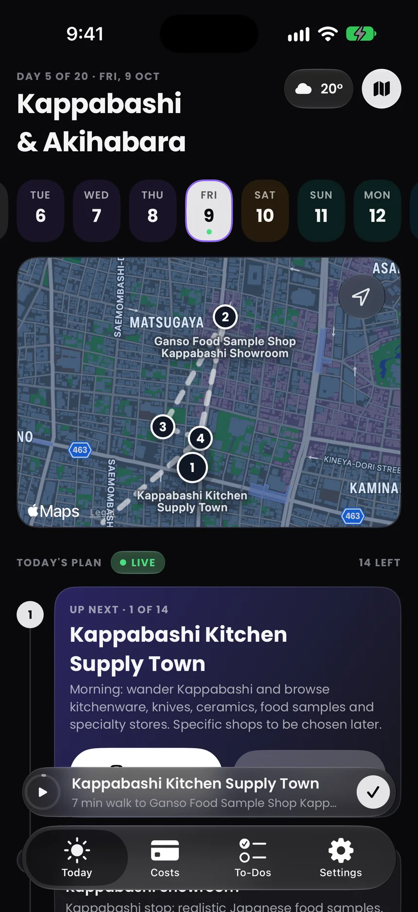
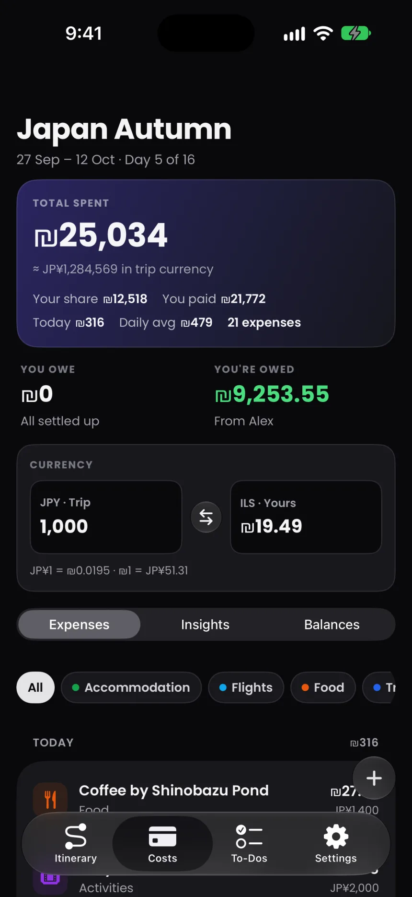
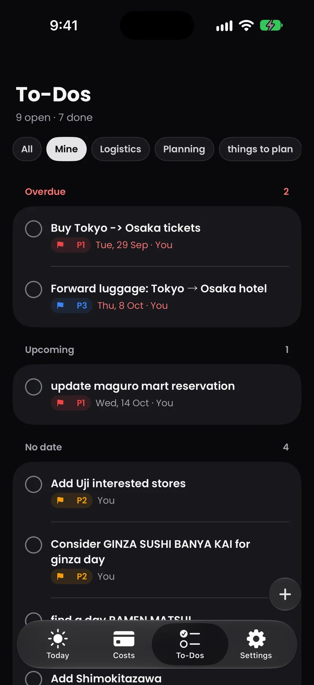
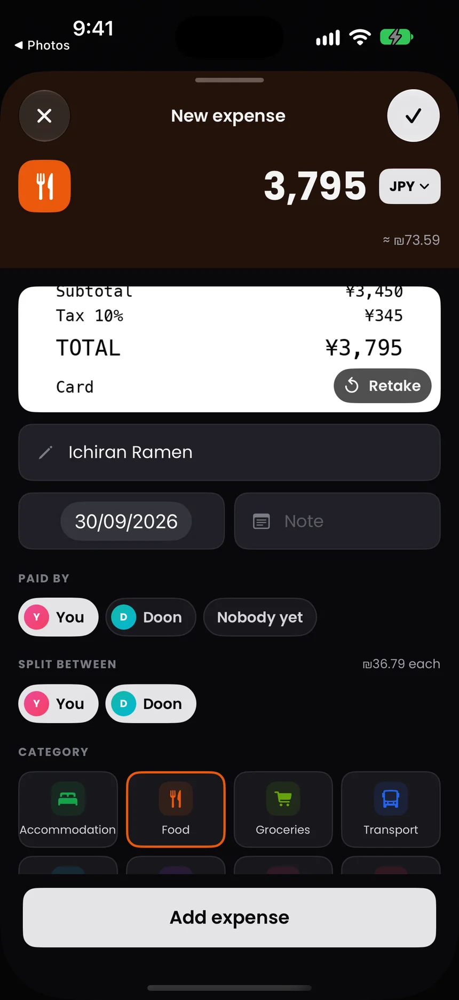
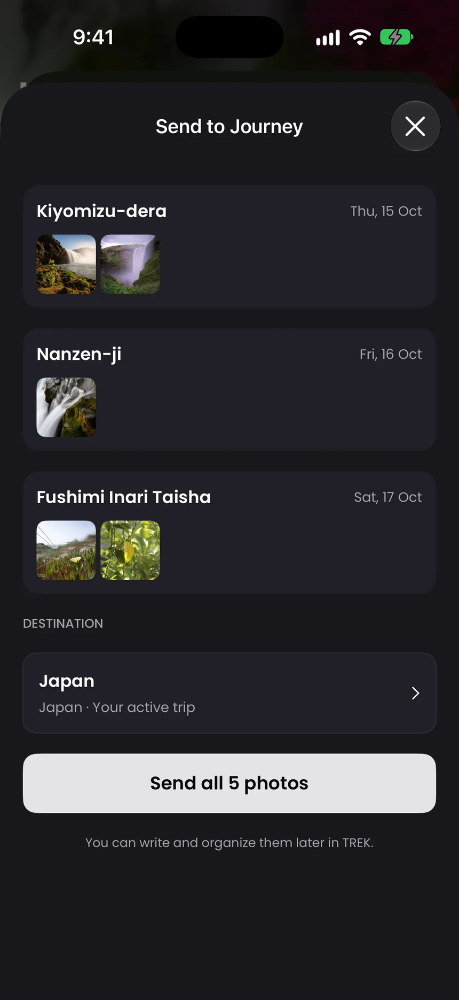
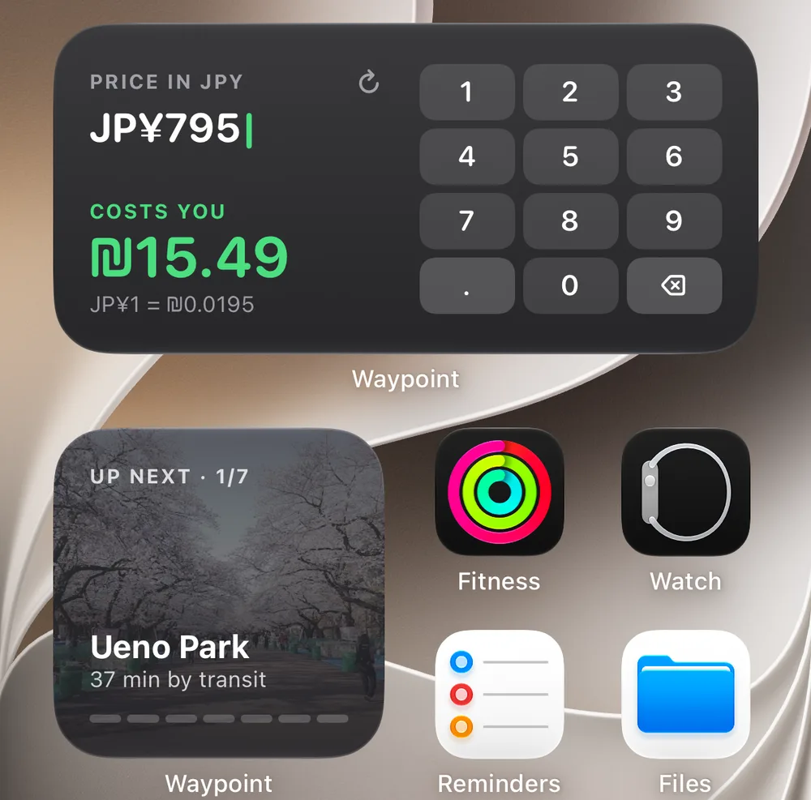

<p align="center">
  
</p>

<h1 align="center">Waypoint</h1>

<p align="center">Plan your trip in TREK. Take it with you on iPhone.</p>

<p align="center">
  <a href="https://apps.apple.com/app/id6817039570">App Store</a> ·
  <a href="#features">Features</a> ·
  <a href="#getting-started">Get started</a> ·
  <a href="#contributing">Contribute</a> ·
  <a href="LICENSE">AGPL-3.0</a>
</p>

Waypoint is a free, open-source iPhone companion for [TREK](https://github.com/liketrek/TREK), the self-hosted trip planner. Follow your itinerary, track shared expenses, check off to-dos, and send photos to your trip's Journey using your own TREK server.

Built with SwiftUI, WidgetKit, and ActivityKit. Requires **iOS 26.1 or later** and an account on a TREK server.

## Screenshots

<table>
  <tr>
    <th>Follow the day</th>
    <th>Track your spending</th>
    <th>Keep to-dos in sight</th>
  </tr>
  <tr>
    <td></td>
    <td></td>
    <td></td>
  </tr>
  <tr>
    <th>Scan a receipt</th>
    <th>Share trip photos</th>
    <th>Glance at your widgets</th>
  </tr>
  <tr>
    <td></td>
    <td></td>
    <td></td>
  </tr>
</table>

Screenshots use trips planned in TREK and captured on an iPhone simulator. You can also watch the [arrival demo](landing/media/arrive.mp4) and [currency converter demo](landing/media/convert.mp4).

## Features

| Feature | What you can do |
| --- | --- |
| Daily itinerary | Browse trip days, stops, notes, stays, and bookings. Switch between the timeline and map, with numbered stops and travel times. |
| Directions | Open the next place in Apple Maps, Google Maps, or Waze. |
| Stop progress | Mark stops done yourself, or let location-based visit detection do it after you spend time there. |
| Shared expenses | Add and edit expenses, choose who paid and who shares the cost, browse categories and spending insights, and see who owes whom. |
| Receipt scanning | Scan or select a receipt to extract its merchant, amount, currency, and date on the device, then review it before saving. |
| Apple Pay shortcut | Set up a personal Transaction automation in Shortcuts to add payments to your selected trip. |
| Currency conversion | Convert between your display currency and the trip currency, using rates from Frankfurter. |
| To-dos | Create, edit, and complete tasks with priorities, due dates, assignees, and filters for your tasks or a list. |
| Reminders | Configure local notifications for to-dos, bookings, check-in and check-out, morning plans, and the countdown to departure. |
| Journey photo sharing | Share selected photos from Photos to a TREK Journey. Match photos to trip stops using capture time and location, and manage pending uploads. |
| Widgets | See your next stop and today's spending, or use the interactive currency converter from the Home Screen. |
| Live Activity | Keep the next stop, day progress, and spending on the Lock Screen and Dynamic Island on supported iPhones. |
| Light and dark appearance | Follow your iPhone's appearance throughout the app. |

Receipt scanning requires Apple Intelligence to be available on the device. Manual expense entry works without it, and expense categorisation falls back to keyword rules. To-dos and Journey sharing depend on the corresponding features being enabled on your TREK server. Automatic stop progress needs location permission; reminders need notification permission.

## Getting started

1. Set up a [TREK server](https://github.com/liketrek/TREK#readme), or get an account on one you already use. Create a trip in TREK first.
2. Install [Waypoint from the App Store](https://apps.apple.com/app/id6817039570), or [build it from source](#build-from-source).
3. Enter your TREK server's address and sign in with your email and password. Waypoint also supports TREK's MFA verification-code step.
4. Choose the trip you want to use. You can switch later in **Settings → Change Trip**.
5. Finish the shortcut setup. To log Apple Pay payments automatically, create a **Transaction** automation in Shortcuts, select your cards, choose **Run Immediately**, and run **Waypoint - TREK costs**.

Your server must be reachable from the iPhone. Use an HTTPS address for your server. Waypoint uses TREK's API directly; it does not host a server or create a separate Waypoint account. The current sign-in flow uses password login, so a server configured for SSO-only login will need a supported password sign-in option.

## Privacy

Your server address, email, password, and session token are stored in the iPhone's Keychain. Trips, expenses, and shared photos are sent to the TREK server you choose. Receipt extraction and expense categorisation run on the device.

Waypoint has no analytics, advertising, or tracking. Currency conversion contacts Frankfurter with a currency code. Journey photo uploads preserve photo metadata, including capture time and embedded location.

Read the [privacy policy](PRIVACY.md) for details about location, shared storage, and pending photo uploads.

## Build from source

The iPhone app is a native Swift project. Bun is needed only for the landing page, videos, and release tooling.

### Requirements

- A Mac with Xcode. The project is currently developed with **Xcode 27** and **Swift 6**.
- An iPhone simulator or iPhone running **iOS 26.1 or later**.
- A reachable TREK server and an account with a trip to test against.

### Run in the simulator

```sh
git clone https://github.com/skylineagle/waypoint.git
cd waypoint
open TrekCompanion.xcodeproj
```

Select the **TrekCompanion** scheme, choose an iPhone simulator, and run with **⌘R**. Sign in to your TREK server through the app's onboarding. There are no API keys or `.env` files to configure for the iPhone app.

Use a simulator for itinerary, expense, and layout work. Verify camera scanning, Apple Intelligence, background location, and Apple Pay automation on a suitable physical iPhone.

### Run on your own iPhone

The checked-in signing configuration uses the maintainer's development team and identifiers. For your own device:

1. Select your Apple development team in **Signing & Capabilities** for the app, widget extension, and share extension.
2. Set unique bundle identifiers for all three targets.
3. Replace `group.dev.horizon.trekcompanion` consistently in [Shared/AppGroup.swift](Shared/AppGroup.swift) and the three entitlement files.
4. Replace the shared Keychain identifiers consistently in the [app entitlements](TrekCompanion.entitlements), [share entitlements](TrekCompanionShare.entitlements), [app Info.plist](TrekCompanion-Info.plist), and [share Info.plist](TrekCompanionShare-Info.plist).
5. Let Xcode create the matching provisioning profiles, then select your iPhone and run.

App Groups and shared Keychain access are needed for the extensions. Available signing capabilities depend on your Apple developer account. Keep signing changes local unless they are part of an agreed project change.

### Run checks

From the repository root, with Xcode's command-line tools selected:

```sh
bash scripts/check-journey-sharing.sh
bash scripts/check-widget-photos.sh
```

These compile and run focused Swift checks for photo sharing, upload state, URL handling, and widget snapshots. Other focused checks live in [Checks/](Checks/). They complement checking the changed behavior in the app.

If you change release tooling, run its Bun tests:

```sh
bun test scripts/new-version.test.ts
```

### Landing page

With [Bun](https://bun.sh) installed:

```sh
cd landing
bun install --frozen-lockfile
bun run dev
```

Open `http://localhost:4321`. Run `bun run build` to generate the static site in `landing/dist`.

## Repository layout

| Path | Purpose |
| --- | --- |
| [`TrekCompanion/`](TrekCompanion/) | SwiftUI app, TREK API client, itinerary, expenses, to-dos, and onboarding. |
| [`TrekCompanionWidgets/`](TrekCompanionWidgets/) | Home Screen widgets, interactive converter, and Live Activity views. |
| [`TrekCompanionShare/`](TrekCompanionShare/) | Photos share extension. |
| [`Shared/`](Shared/) | App Group storage, settings, money helpers, and shared widget state. |
| [`JourneyShared/`](JourneyShared/) | Photo preparation, Journey selection, and upload handling shared by the app and extension. |
| [`Checks/`](Checks/) | Focused Swift checks and UI flow files. |
| [`landing/`](landing/) | Public website and the screenshots used in this README. |
| [`videos/`](videos/) | Remotion video source, recordings, and audio. |
| [`design/`](design/) | Design explorations and shortcut-generation tooling. |
| [`scripts/`](scripts/) | Checks, simulator helpers, and maintainer release tooling. |
| [`metadata/`](metadata/) | App Store metadata. |

The release scripts target the maintainer's App Store account. See [scripts/releases.md](scripts/releases.md) for that workflow; they are not needed to build or contribute to the app.

## Contributing

Bug reports, documentation improvements, and focused pull requests are welcome. For a larger feature or a change to the app's design, [open an issue](https://github.com/skylineagle/waypoint/issues) first so we can agree on the behavior and scope.

### Report a problem

Include the Waypoint version, iOS version, device model, TREK version, steps to reproduce, and what you expected to happen. A screenshot or short recording helps with UI issues. Mention relevant server add-ons or authentication settings, but remove passwords, session tokens, private server addresses, and other sensitive details from attachments and logs.

### Submit a pull request

1. Fork the repository and create a branch for one change.
2. Follow the nearby Swift and SwiftUI patterns. Keep names clear, changes small, and reuse existing helpers before adding dependencies.
3. Run the relevant checks and verify the behavior in the app. For UI changes, include before-and-after screenshots and check light and dark appearance, larger text, and keyboard behavior where relevant.
4. Describe the problem, what changed, and how you tested it. State any device behavior you could not verify.
5. Keep personal signing settings, credentials, build output, and unrelated formatting changes out of the pull request.

Contributions are submitted under the project's [AGPL-3.0 license](LICENSE). Preserve third-party notices when adding or updating assets and dependencies.

## License and trademarks

Copyright (c) 2026 Ofek Nesher and contributors.

Waypoint's original source code and documentation are licensed under **AGPL-3.0-only**, matching TREK's license family. You may clone, build, modify, and use it privately. Redistribution, including paid redistribution, must meet the AGPL's source-sharing and other requirements. Modified versions that support remote network interaction must offer their corresponding source to those users as required by section 13. See [LICENSE](LICENSE) for the full terms. The software is provided without warranty.

The code license does not grant trademark rights to the **Waypoint name, app icon, or logos**. Personal builds and source forks may retain the existing branding. Publicly distributed builds and services must use their own branding unless Ofek Nesher grants permission. See [TRADEMARKS.md](TRADEMARKS.md).

Bundled fonts retain their SIL Open Font License. See [NOTICE.md](NOTICE.md) for third-party attribution and license files.

Waypoint is an independent project by Ofek Nesher. It is not an official TREK app and is not endorsed by the TREK project. TREK's name and branding are governed by [TREK's trademark policy](https://github.com/liketrek/TREK/blob/main/TRADEMARKS.md).
